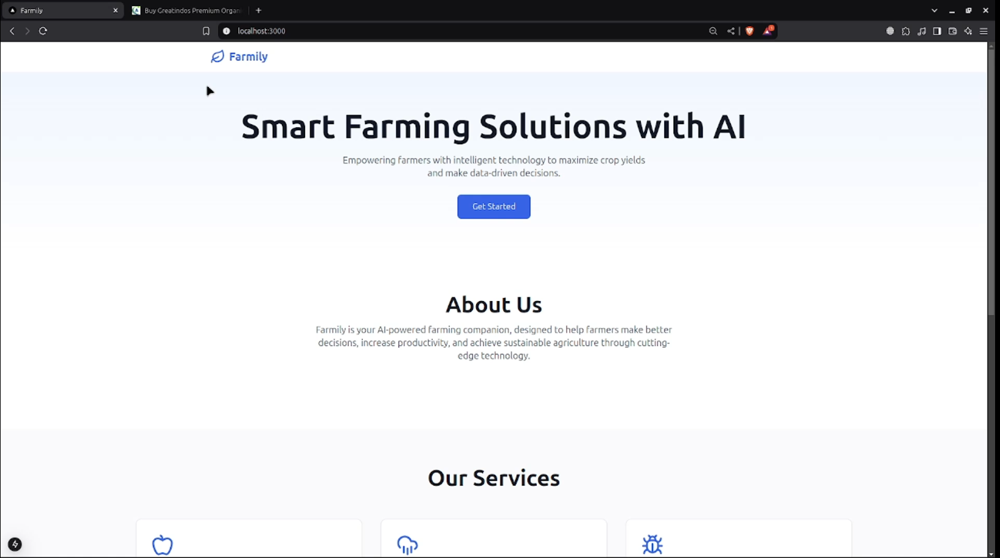

# 🌾 Farmily - Where Farming Meets Family! 🌱  

## 🚀 Homepage
Farmily is an innovative **smart agricultural platform** that empowers farmers by providing **AI-driven solutions** to tackle crop diseases, climate change, and resource inaccessibility. By leveraging modern technologies, Farmily helps farmers maximize productivity and sustainability.

---

## 🎥 Demo Video  
[](https://drive.google.com/file/d/1oIUoO05oz_Lwh3raI9RKCTdo7pTq15ZD/view?usp=sharing)


---

## 📷 Screenshots  
### 🌿 Crop Disease Detection  
  

### 🌾 Crop Recommendation System  
  

---

## 🛠️ Tech Stack  
### 🌐 Frontend  
- **Next.js** – SEO-friendly, server-side rendering.  
- **TypeScript** – Ensures type safety and maintainability.  
- **Tailwind CSS** – Modern UI styling.  

### 🔗 Backend & AI/ML  
- **Python** – Core backend and AI development.  
- **TensorFlow** – Deep learning for crop disease detection.  
- **Scikit-Learn** – Machine learning models for predictions.  
- **OpenCV** – Image processing for plant health analysis.  

---

## 📌 How to Run the Project  
1️⃣ Clone the repository:  
```bash
git clone https://github.com/UmeshKumar0143/Farmily.git
cd farmily
```
2️⃣ Install dependencies:  
```bash
npm install   # For frontend
pip install -r requirements.txt   # For backend (if using Python)
```
3️⃣ Run the application:  
```bash
npm run dev   # Start frontend
python app.py   # Run backend server
```

---


## 📢 Future Enhancements  
🔹 IoT integration for real-time soil & climate monitoring.  
🔹 AI-powered **yield prediction models**.  
🔹 Multi-language support for better accessibility.  

---

## 🤝 Get Involved  
🌟 Found a bug? Report it in the **Issues** section.  
📩 Want to contribute? Check out our **Contributing Guidelines**.  
🔗 Stay connected: [LinkedIn | Twitter | Discord]  

---

## 📜 License  
This project is licensed under the **MIT License**.
